# JavaScript 设计模式

## 面向对象

### 开发环境
- 初始化 npm 环境
  - node v6以上
  - npm init
- 安装 webpack
  - npm i webpack webpack-cli -D
- 安装 webpack-dev-server
  - npm i webpack-dev-server html-webpack-plugin -D
- 安装 babel
  - npm i babel-core babel-loader@7.1.4 babel-polyfill babel-preset-es2015 babel-preset-latest -D

### 什么是面向对象
- 概念
  - 类
  - 对象(实例)
- 三要素：继承 封装 多态
  - 继承，子类继承父类
    - 继承可将公共方法抽离出来，提高复用，减少冗余。
  - 封装，数据的权限和保密。public 完全开放、protected 对子类开放、private 对自己开放。
    - 减少耦合，不该外露的不外露
    - 利于数据、接口的权限管理
    - es6 目前不持支，一般认为 _ 开头的属性是 private
  - 多态，同一接口不同实现。js 应用极少。需要结合 java 等语言的接口、重写、重载等功能。
    - 保持子类的开放性和灵活性
    - 面向接口编程
    - js 引用极少，了解即可
- JS 应用举例
- 面向对象的意义
  - 程序执行：顺序、判断、循环 —— 结构化（goto 语句会导致程序结构的混乱不够结构化所以被淘汰）
  - 面向对象 —— 数据结构化
  - 对于计算机，结构化的才是最简单的
  - 编程应该 简单&抽象

### UML 类图
- Unified Modeling Language 统一建模语言
- 类图，UML 包含很多种图，和本课程相关的是类图
- 关系，主要讲解泛化和关联

#### 画图工具
- MS Office visio
- https://www.processon.com/

#### 关系
- 泛化，表示继承
- 关联，表示引用

## 设计原则
- 何为设计？
- 五大设计原则
- 从设计到模式
- 23 种设计模式

### 何为设计

#### 描述
- 即按照哪一种思路，或者标准来实现功能
- 功能相同，可以有不同设计方案来实现
- 伴随需求增加，设计的作用才能体现出来

#### 《UNIX/LINUX设计哲学》
- 准则1：小即是美
- 准则2：让每个程序只做好一件事
- 准则3：快速建立原型
- 准则4：舍弃高效率而取可移植性
- 准则5：采用纯文本来存储数据
- 准则6：充分利用软件的杠杆效应（软件复用）
- 准则7：使用 shell 脚本来提高杠杆效应和可移植性
- 准则8：避免强制性的用户界面
- 准则9：让每个程序都称为过滤器

#### 《UNIX/LINUX设计哲学》 - 小准则
- 允许用户定制环境
- 尽量使操作系统内核小而轻量化
- 使用小写字母并尽量简短 
- 沉默是金
- 各部分之和大于整体
- 寻求 90% 的解决方案

#### 演示：沉默是金 + 准则9：让每个程序都称为过滤器
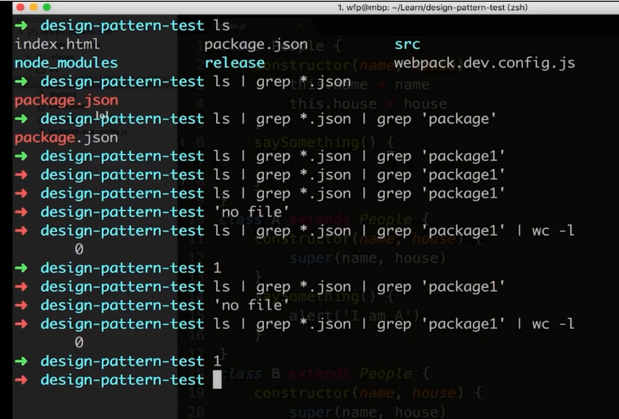

### SOLID 五大设计原则
- S - 单一职责原则
  - 一个程序只做好一件事
  - 如果功能过于复杂就拆分开，每个部分保持独立
- O - 开放封闭原则
  - 对扩展开放，对修改封闭
  - 增加需求时，扩展新代码，而非修改已有代码
  - 这是软件设计的终极目标
- L - 李氏置换原则
  - 子类能覆盖父类
  - 父类能出现的地方子类就能出现
  - JS 中使用较少（弱类型 & 继承使用较少）
- I - 接口独立原则
  - 保持接口的单一独立，避免出现“胖接口”
  - JS 中没有接口（typescript除外），使用较少
  - 类似于单一职责原则，这里更关注接口
- D - 依赖倒置原则
  - 面向接口编程，依赖于抽象而不依赖于具体
  - 使用方只关注接口而不关注具体类的实现
  - JS 中使用较少（没有接口 & 弱类型）

#### 设计原则总结
- S O 体现较多
- L I D 体现较少

### 从设计到模式
- 设计
- 模式
- 分开
- 从设计到模式

### 介绍 23 种设计模式
- 创建型
  - 工厂模式（工厂方法模式、抽象工厂模式、建造者模式）
  - 单例模式
  - 原型模式
- 结构型（组合型）
  - 适配器模式
  - 装饰器模式
  - 代理模式
  - 外观模式
  - 桥接模式
  - 组合模式
  - 享元模式
- 行为型
  - 策略模式
  - 模板方法模式
  - 观察者模式
  - 迭代器模式
  - 职责连模式
  - 命令模式
  - 备忘录模式
  - 状态模式
  - 访问者模式
  - 中介者模式
  - 解释器模式

### 面试题示例
- 第一题是某打车公司一面；第二题是某短视频三面；
- 考察面向对象和设计能力

#### 第一题
- 打车时，可以打专车或者快车。任何车都有车牌号和名称。
- 不同车价格不同，快车每公里1元，专车每公里2元。
- 行驶开始时，显示车辆信息
- 行程结束时，显示打车金额（假定行程就5公里）
- 画出 UML 类图
- 用 ES6 语法写出该示例

解答：
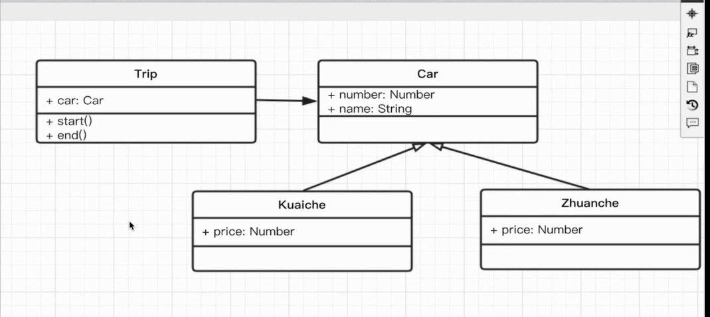
```js
class Car {
  constructor(number, name) {
    this.number = number
    this.name = name
  }
}

class Kuaiche extends Car {
  constructor(number, name) {
    super(number, name)
    this.price = 1
  }
}

class Zhuanche extends Car {
  constructor(number, name) {
    super(number, name)
    this.price = 2
  }
}

class Trip {
  constructor(car) {
    this.car = car
  }

  start() {
    console.log(`行程开始，名称：${this.car.name},车牌号：${this.car.number}`)
  }
  end() {
    console.log('行程结束，价格：' + (this.car.price * 5))
  }
}


let car = new Kuaiche(100, '桑塔纳')
let trip = new Trip(car)
trip.start()
trip.end()
```

#### 第二题
- 某停车场，分3层，每层100车位
- 每个车位都能监控到车辆的驶入和离开
- 车辆进入前，显示每层的空余车位数量
- 车辆进入时，摄像头可识别车牌号和时间
- 车辆出来时，出口显示器车牌号和停车时长
- 画出 UML 类图

解答：
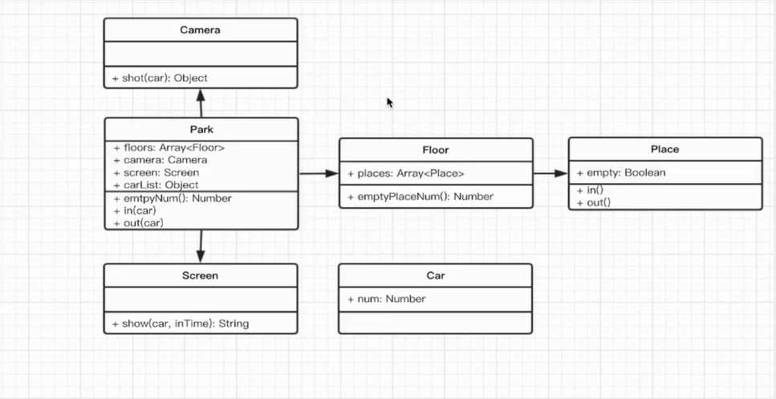
```js
class Car {
  constructor(num) {
    this.num = num
  }
}

// 摄像头
class Camera {
  shot(car) {
    return {
      num: car.num,
      inTime: Date.now()
    }
  }
}


// 出口显示屏 
class Screen {
  show(car, inTime) {
    console.log('车牌号：'+car.num)
    console.log('停车时间：'+（Date.now() - inTime）)
  }
}
// 停车场
class Park {
  constructor(floors) {
    this.floors = floors || []
    this.camera = new Camera()
    this.screen = new Screen()
    this.carList = {} // 存储摄像头拍摄返回的车辆信息
  }

  in(car) {
    // 通过摄像头获取信息
    const info = this.camera.shot(car)
    // 停到某个停车位
    const i = parseInt(Math.random() * 100 % 100)
    const place = this.floors[0].places[i]
    place.in()
    info.place = place
    // 记录信息
    this.carList[car.num] = info
  }
  out(car) {
    // 获取信息
    const info = this.carList[car.num]
    // 将停车位清空
    const place = info.place
    place.out()
    // 显示时间
    this.screen.show(car, info.inTime)
    // 清空记录
    delete this.carList[car.num]
  }
  emptyNum {
    return this.floors.forEach(floor => {
      return `${floor.index} 层还有 ${floor.emptyPlaceNum()} 个空闲车位`
    }).join('\n')
  }
}

// 层
class Floor {
  constructor(index, places) {
    this.index = index
    this.places = places || []
  }

  emptyPlaceNum() {
    let num = 0
    this.places.forEach(p => {
      if (p.empty) {
        num += 1
      }
    })
    return num
  }
}

// 车位
class Place {
  constructor() {
    this.empty = true
  }

  in() {
    this.empty = false
  }

  out() {
    this.empty = true
  }
}

// 测试 -------------------
// 初始化停车场
const floors = []
for (let i = 0; i < 3; i++) {
  const places = []
  for (let j = 0; j < 100; j++) {
    places[j] = new Place()
  }
  floors[i] = new Floor(i + 1, places)
}

const park = new Park(floors)

// 初始化车辆
const car1 = new Car(100)
const car2 = new Car(200)
const car3 = new Car(300)

console.log('第一辆车进入')
console.log(park.emptyNum())
park.in(car1)
console.log('第二辆车进入')
console.log(park.emptyNum())
park.in(car2)
console.log('第一辆车离开')
park.out(car1)
console.log('第二辆车离开')
park.out(car2)
console.log('第三辆车进入')
console.log(park.emptyNum())
park.in(car3)
console.log('第三辆车离开')
park.out(car3)
```

## 工厂模式
- 将 new 操作单独封装
- 遇到 new 时，就要考虑是否该使用工厂模式

### 示例
- 你去购买汉堡，直接点餐、取餐不会自己亲手去做
- 商店要“封装”做汉堡的工作，做好直接给买者

### 传统 UML 类图（用 java 学习的时候）
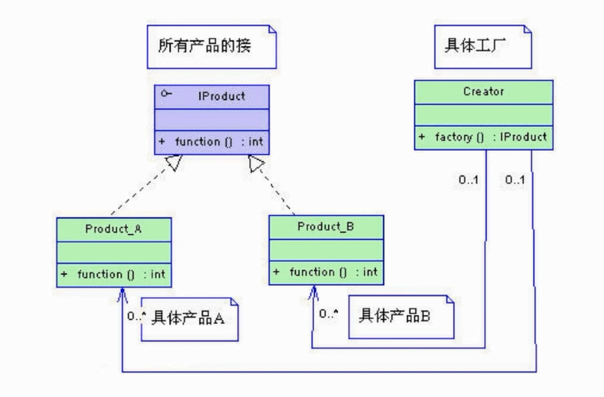

### 简化后的 UML 类图
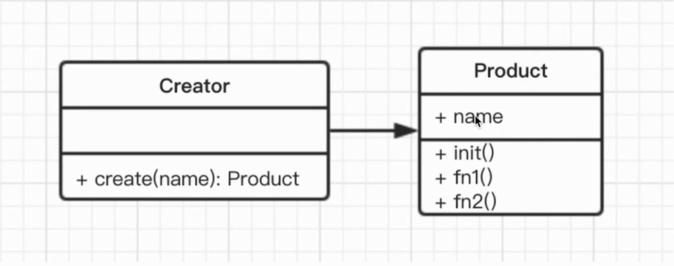

### 场景
- jQuery - $('div')
  - $('div') 和 new $('div')有何区别？
  - 第一：书写麻烦，jQuery 的链式操作将成为噩梦
  - 第二：一旦 jQuery 名字发生变化，将是灾难性的
- React.createElement()
- vue 异步组件

### 设计原则验证
- 构造函数和创建者分离
- 符合开放封闭原则

## 单例模式
- 系统中被唯一使用
- 一个类只有一个实例

### 示例
- 登录框
- 购物车

### 传统 UML 类图
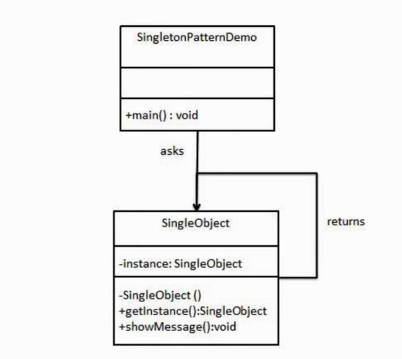

### 说明
- 单例模式需要用到 java 的特性（private）
- ES6 中没有（typescript除外）
- 用 java 代码来演示 UML 图内容  
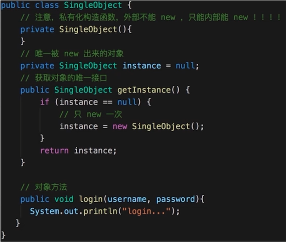
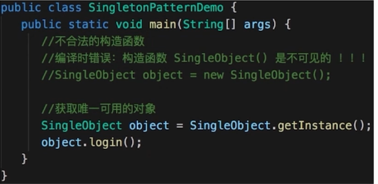

### JS 使用单例模式
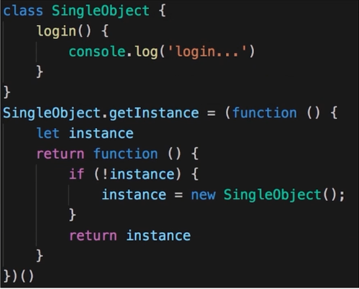
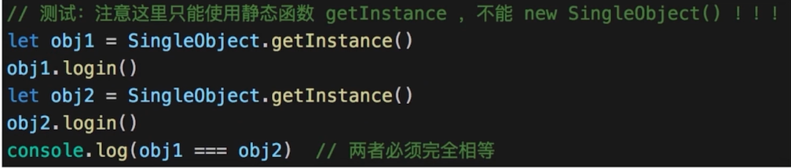

### 场景
- jQuery 只有一个$
```js
if (window.jQuery != null) {
  return window.jQuery
} else {
  // 初始化...
}
```

### 设计原则验证
- 符合单一职责原则，只实例化唯一的对象
- 没法具体开放封闭原则，但是绝对不违反 

## 适配器模式
- 旧接口格式和使用者不兼容
- 中间加一个适配转换接口

### 传统 UML 类图
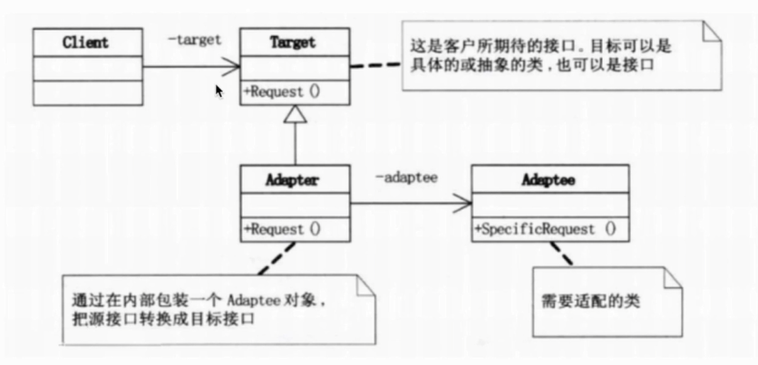

### 简化后的 UML 类图
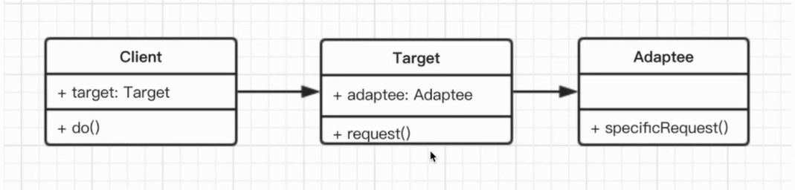

### 场景
- 封装旧接口  
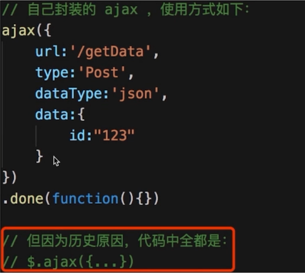
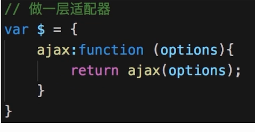
- vue computed  
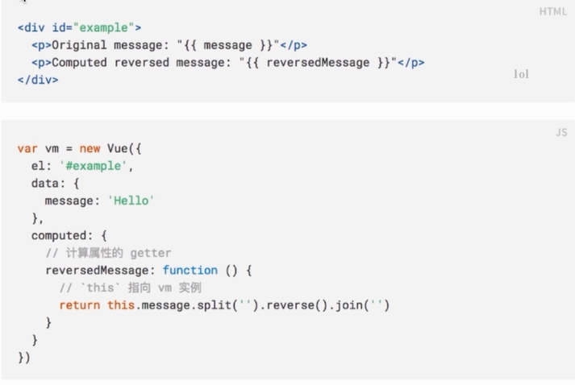

### 设计原则验证
- 将旧接口和使用者进行分离
- 符合开放封闭原则

## 装饰器模式
- 为对象添加新功能
- 不改变其原有的结构和功能

### 传统 UML 类图
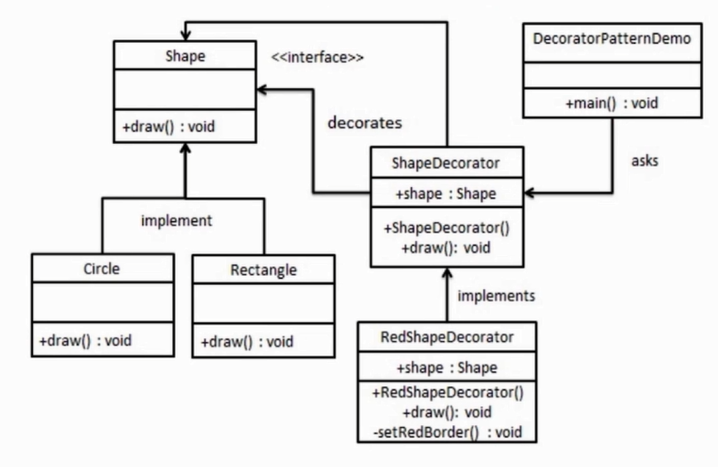

### 简化后的 UML 类图
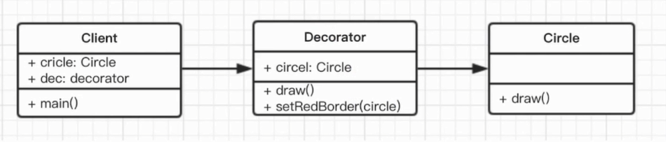

### 场景
- ES7 装饰器
- core-decorators

#### ES7 装饰器
配置环境：
```
npm install babel-plugin-transform-decorators-legacy -D
``` 
装饰类：  
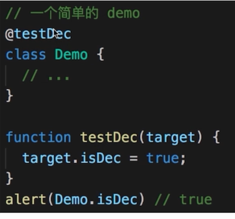

装饰方法：  
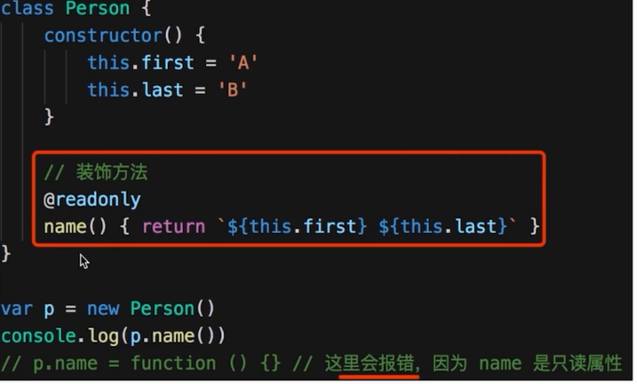
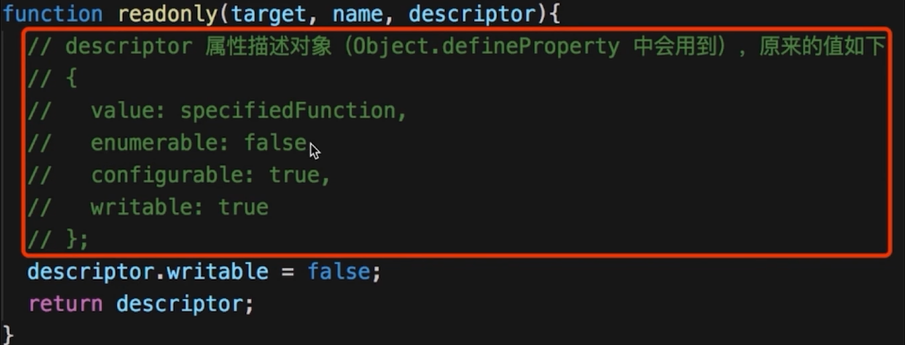
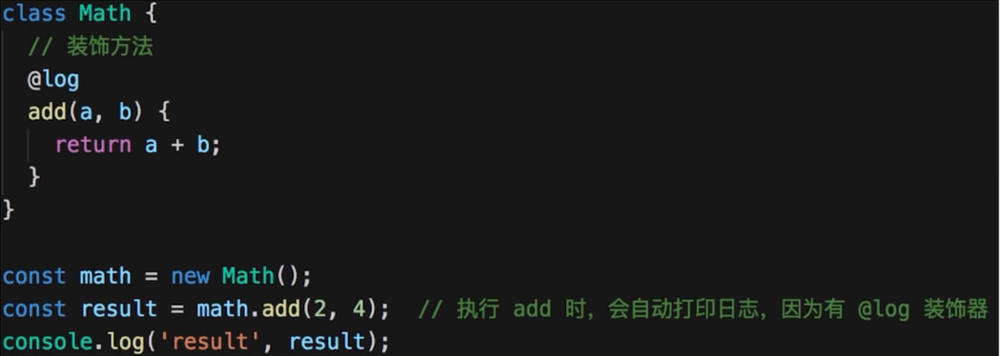
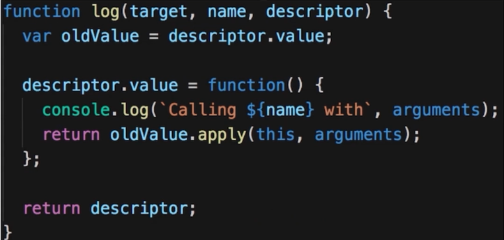

#### core-decorators
- 第三方开源 lib
- 提供常用的装饰器
- 查阅文档：github.com/jayphelps/core-decorators  
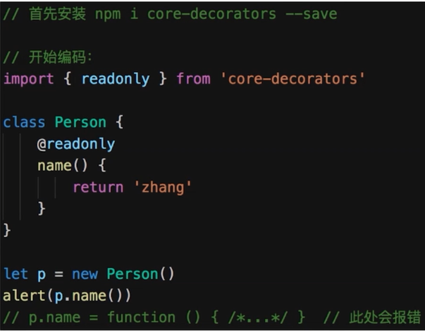
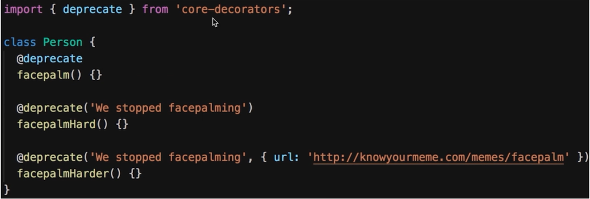

### 设计原则验证
- 将现有对象和装饰器进行分离，两者独立存在
- 符合开放封闭原则

## 代理模式
- 使用者无权访问目标对象
- 中间加代理，通过代理做授权和控制

### 传统 UML 类图
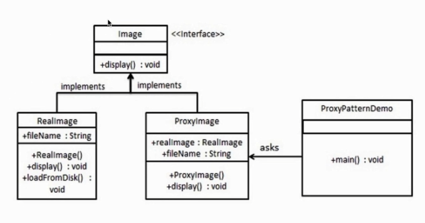

### 简化后的 UML 类图
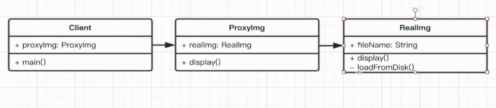

### 场景
- 网页事件代理
- jQuery $.proxy  
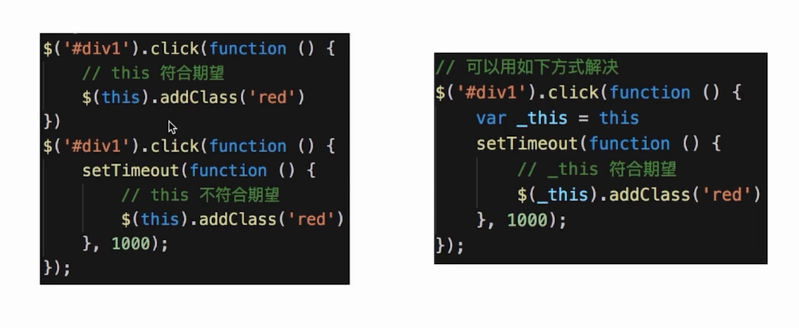
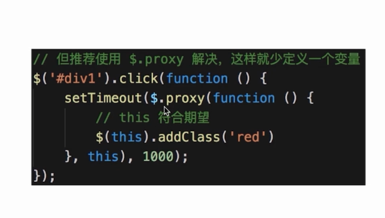
- ES6 proxy  
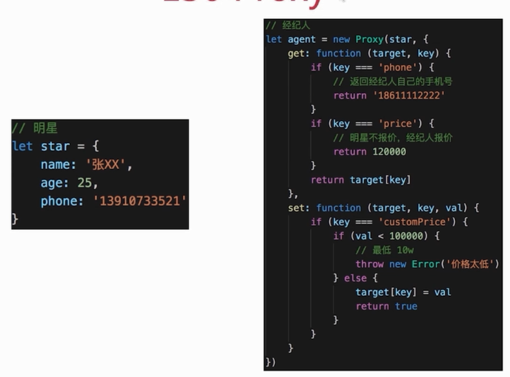

### 设计原则验证
- 代理类和目标类分离，隔离开目标类和使用者
- 符合开放封闭原则

### 代理模式 vs 适配器模式
- 适配器模式：提供一个不同的接口（如不同版本的插头）
- 代理模式：提供一模一样的接口

### 代理模式 vs 装饰器模式
- 扩展功能，原有功能不变且可以直接使用
- 代理模式：显示原有功能，但是经过限制或者阉割之后的

## 外观模式
- 为子系统中的一组接口提供了一个高层接口
- 使用者使用这个高层接口

### 示例
- 去医院看病，接待员去挂号、门诊、划价、取药

### UML 类图
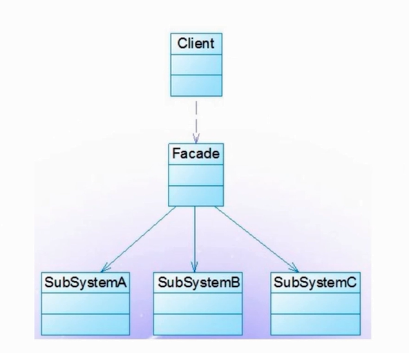

### 场景
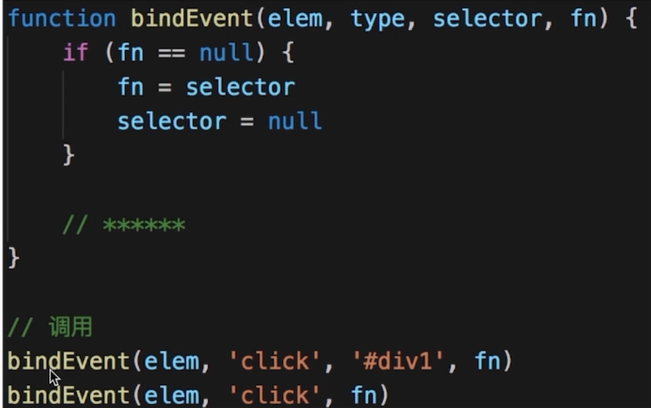

### 设计原则验证
- 不符合单一职责原则和开放封闭原则，因此谨慎使用不可滥用

## 观察者模式
- 发布 & 订阅
- 一对多

### 示例
- 点咖啡，点好之后坐等被叫

### 传统 UML 类图
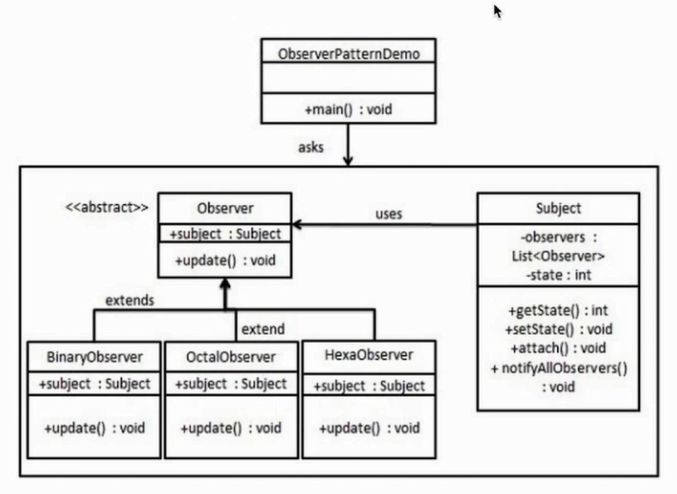

### 简化后的 UML 类图
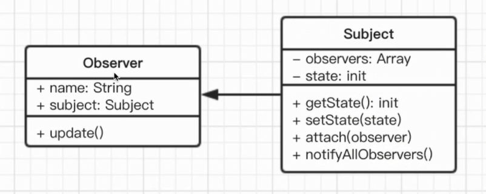

```js
// 主题，保存状态，状态变化之后触发所有观察者对象
class Subject {
  constrouctor() {
    this.state = 0
    this.observers = []
  }

  getState() {
    return this.state
  }

  setState() {
    this.state = state
    this.notifyAllObservers()
  }
  notifyAllObservers() {
    this.observers.forEach(observer => {
      observer.update()
    })
  }
  attach(observer) {
    this.observers.push(observer)
  }
}

// 观察者
class Observer {
  constructor(name, subject) {
    this.name = name
    this.subject = subject
    this.subject.attach(this)
  }

  update() {
    console.log(`${this.name} update, state: ${this.subject.getState()}`)
  }
}

// 测试
let s = new Subject()
let o1 = new Observer('o1', s)
let o2 = new Observer('o2', s)
let o3 = new Observer('o3', s)

s.setState(1)
s.setState(2)
s.setState(3)
```

### 场景
- 网页事件绑定
- Promise
- jQuery callback  
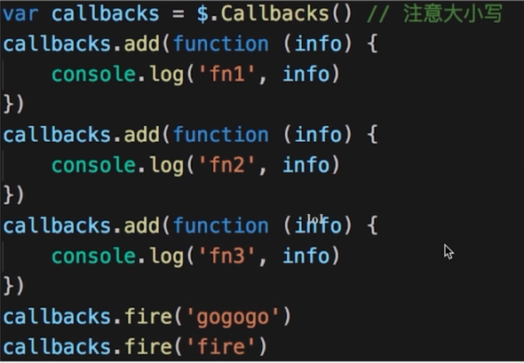
- nodejs 自定义事件  
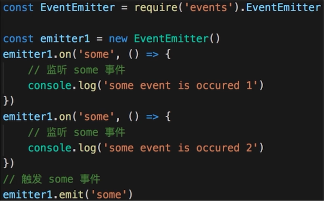
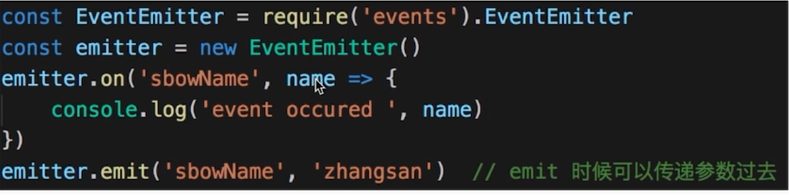
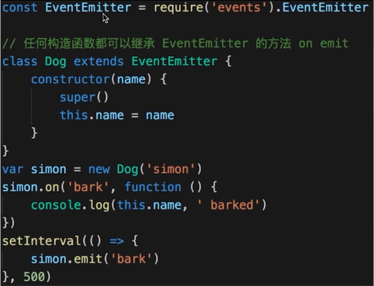
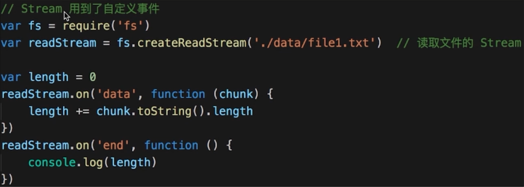
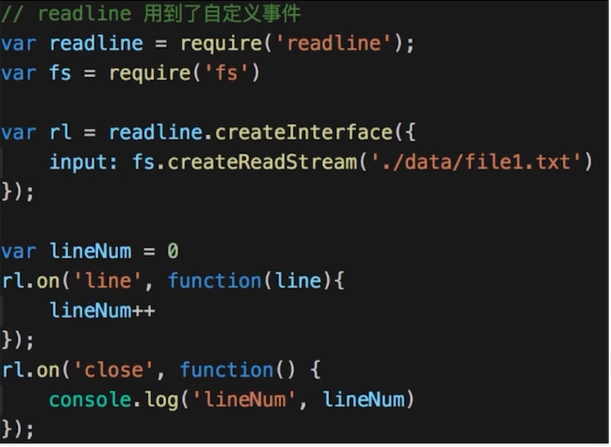

### 其他场景
- nodejs 中：处理 http 请求；多进程通讯  
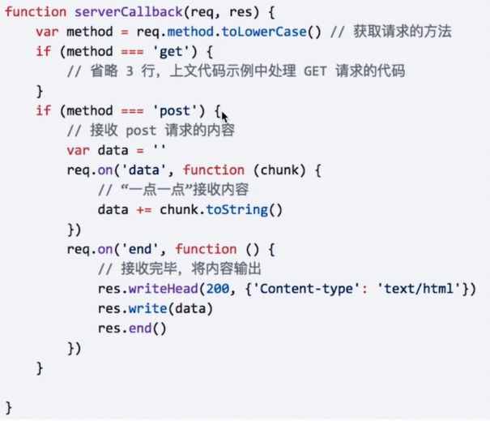
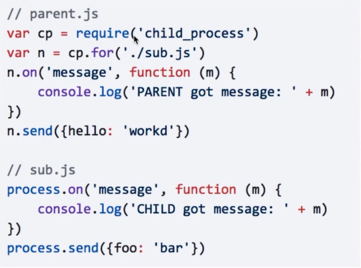
- vue 和 React 组件生命周期触发
- vue watch

### 设计原则验证
- 主题和观察者分离，不是主动触发而是被动监听，两者解耦
- 符合开放封闭原则

## 迭代器模式
- 顺序访问一个集合
- 使用者无需知道集合的内部结构（封装）

### 示例
- 没有合适的示例，用常用的 jQuery 演示一下  
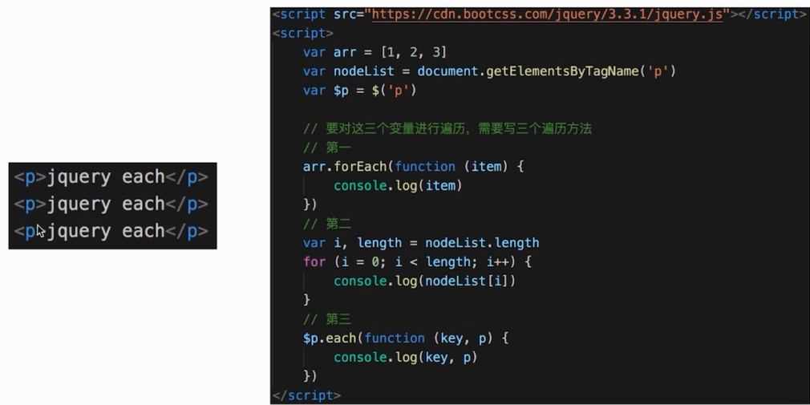

### 传统 UML 类图
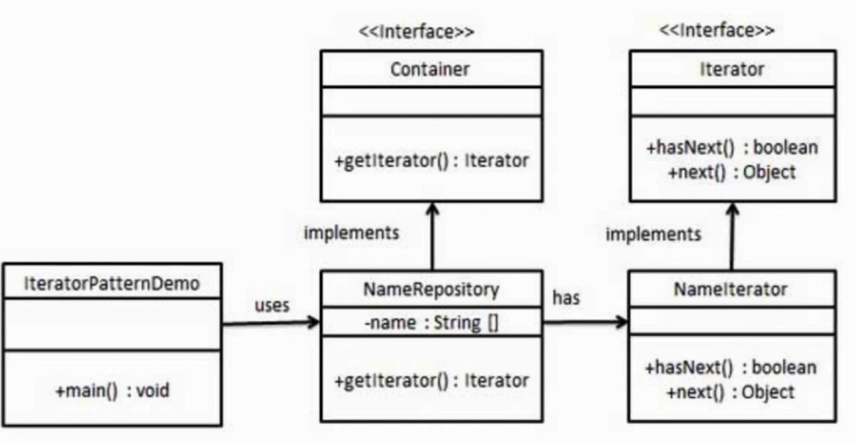

### 简化的 UML 类图
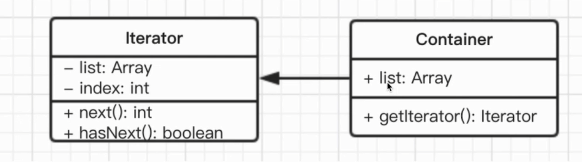

```js
class Iterator {
  constructor(container) {
    this.list = container.list
    this.index = 0
  }

  next() {
    if(this.hasNext()) {
      return this.list[this.index++]
    }

    return null
  }

  hasNext() {
    if(this.index >= this.list.length) {
      return false
    }
    return true
  }
}

class Container {
  constructor(list) {
    this.list = list
  }

  getIterator() {
    return new Iterator(this)
  }
}

let arr = [1,2,3]
let container = new Container(arr)
let iterator = container.getIterator()
while(iterator.hasNext()) {
  console.log(iterator.next())
}
```

### 场景
- jQuery each  
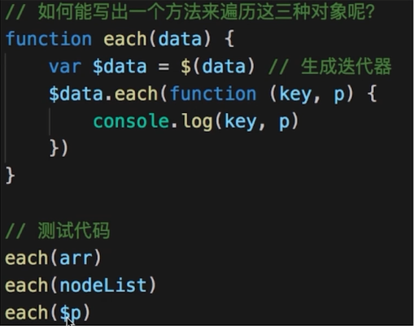
- ES6 Iterator

### ES6 Iterator 为何存在
实现了迭代器模式的一种最简单方法
- ES6 语法中，有序集合的数据类型已经有很多
- Array Map Set String TypeArray arguments NodeList
- 需要有一个统一的遍历接口来遍历所有数据类型
- （注意，object 不是有序集合，可以用 Map 代替）

### ES6 Iterator 是什么
- 以上数据类型，都有 [Symbol.iterator] 属性
- 属性值是函数，执行函数返回一个迭代器
- 这个迭代器就有 next 方法可顺序迭代子元素
- 可运行 Array.prototype[Symbol.iterator] 来测试

### ES6 Iterator 示例
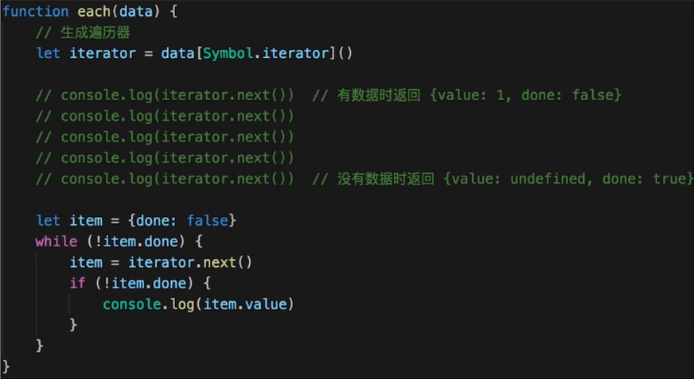

### ES6 Iterator 与 Generator
- Iterator 的价值不限于上述几个类型的遍历
- 还有 Generator 函数的使用
- 即只要返回的数据符合 Iterator 接口要求
- 即可使用 Iterator 语法，这就是迭代器模式  
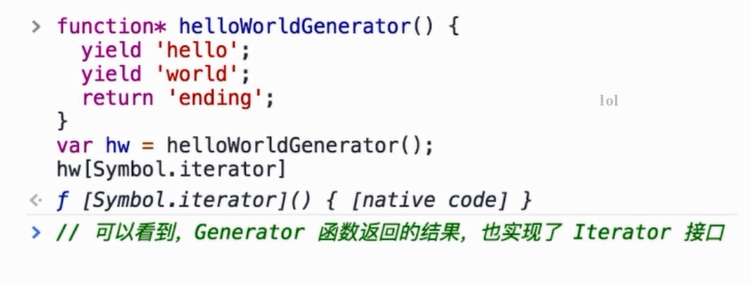

### 设计原则验证
- 迭代器对象和目标对象分离
- 迭代器将使用者与
- 符合开放封闭原则

## 状态模式
- 一个对象有状态变化
- 每次状态变化都会触发一个逻辑
- 不能总是用 if...else 来控制

### 示例
- 交通信号灯

### 传统 UML 类图
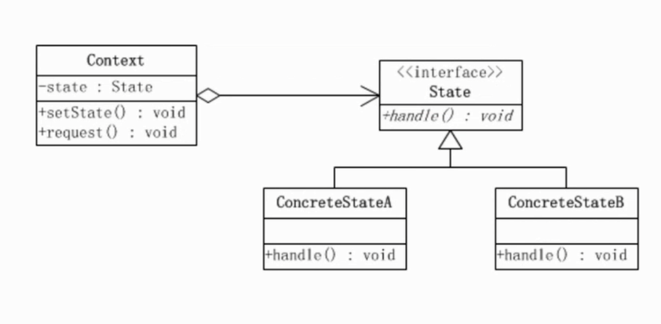

### 简化后 UML 类图


```js
class State {
  constructor(color) {
    this.color = color
  }

  handle(context) {
    console.log(`turn to ${this.color} light`)
    context.setState(this)
  }
}

class Context {
  constructor() {
    this.state = null
  }

  getState() {
    return this.state
  }

  setState(state) {
    this.state = state
  }
}

let context = new Context()
let green = new State('green')
let yellow = new State('yellow')
let red = new State('red')

green.handle(context)
console.log(context.getState())

yellow.handle(context)
console.log(context.getState())

red.handle(context)
console.log(context.getState())
```

### 场景
- 有限状态机
  - 有限个状态、以及在这些状态之间变化
  - 如交通信号灯
  - 使用开源 lib：javascript-state-machine
  - github.com/jakesgordon/javascript-state-machine
- 写一个 Promise

#### 有限状态机代码演示
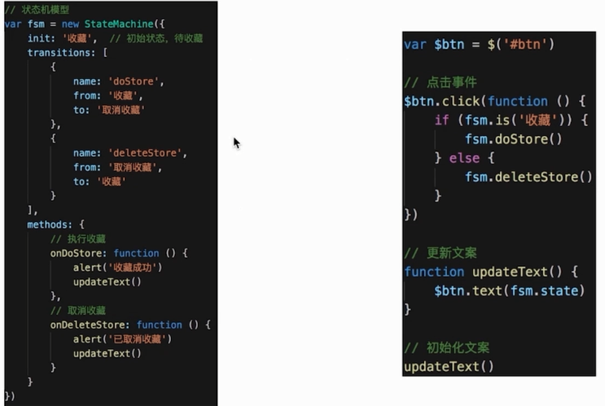

#### 写一个简单的 Promise 代码演示
```js
import StateMachine from 'javascript-state-machine'

// 状态机模型
let fsm = new StateMachine({
  init: 'pending',
  transitions: [
    {
      name: 'resolve',
      from: 'pending',
      to: 'fullfilled'
    },
    {
      name: 'reject',
      from: 'pending',
      to: 'rejected'
    }
  ],
  methods: {
    onResolve: function(state, data) {
      // state -当前状态机实例；data - fsm.resolve(xxx) 传递的参数
      data.succesList.forEach(fn => fn())
    },
    onReject: function(state, data) {
      data.failList.forEach(fn => fn())
    }
  }
})

// 定义 Promise
class MyPromise {
  constructor(fn) {
    this.succesList = []
    this.failList = []

    fn(function() {
      fsm.resolve(this)
    }, function() {
      fsm.reject(this)
    })
  }
  then(succesFn, failFn) {
    this.succesList.push(succesFn)
    this.succesList.push(failFn)
  }
}

function loadImg(src) {
  const promise = new MyPromise(function(resolve, reject) {
    let img = document.createElement('img')
    img.onload = function() {
      resolve(img)
    }
    img.onerror = function() {
      reject()
    }
    img.src = src
  })
  return promise
}

let src = 'xxx'
let result = loadImg(src)

result.then(function() {
  console.log('ok1')
}, function() {
  console.log('fail1')
})

result.then(function() {
  console.log('ok2')
}, function() {
  console.log('fail2')
})
```

### 设计原则验证
- 将状态对象和主题对象分离，状态的变化逻辑单独处理

## 其他设计模式

### 优先级划分依据
- 不常用
- 对应不到经典的应用场景

### 原型模式
- clone 自己，生成一个新对象
- java 默认有 clone 接口，不用自己实现

#### JS 中的应用 - Object.create
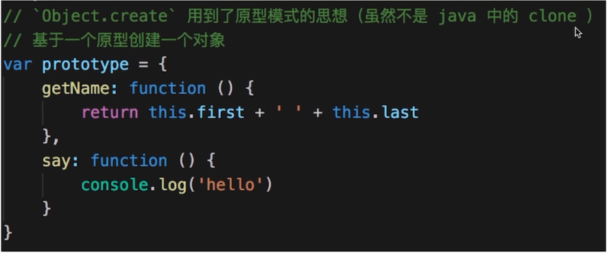
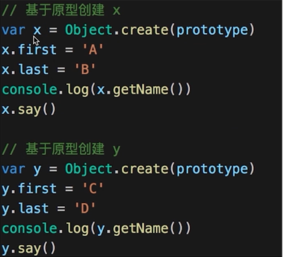

#### 对比 JS 中的原型 prototype
- prototype 可以理解为 ES6 class 的一种底层原理
- 而 class 是实现面向对象的基础，并不是服务于某一种模式
- 若干年后 ES6 全面普及，大家可能会忽略掉 prototype
- 但是 Object.create 却会长久存在

### 桥接模式
- 用于把抽象化与实现化解耦
- 使得二者可以独立变化

#### 演示
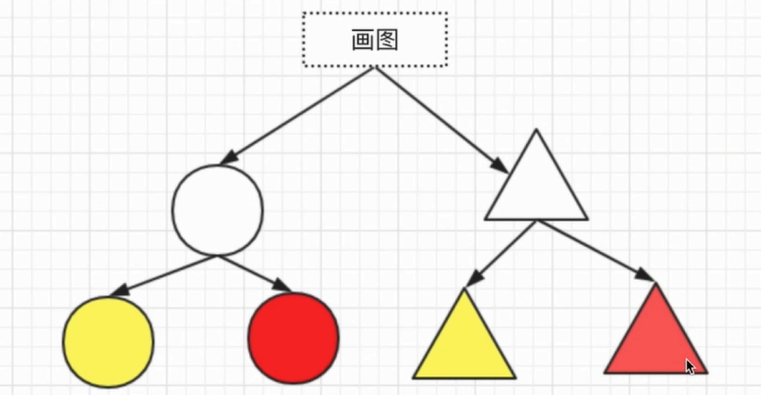
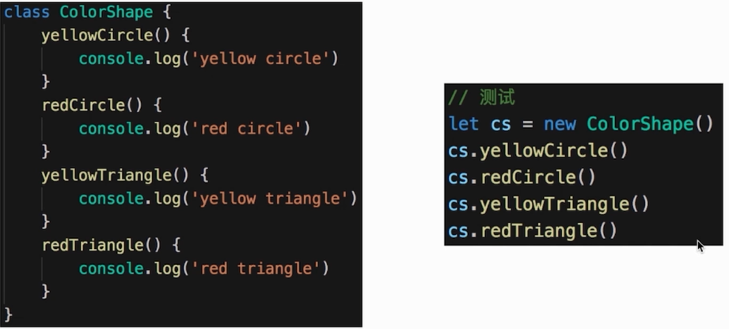
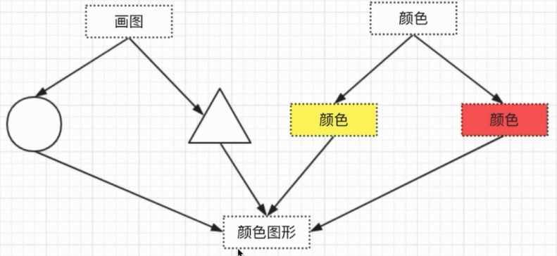
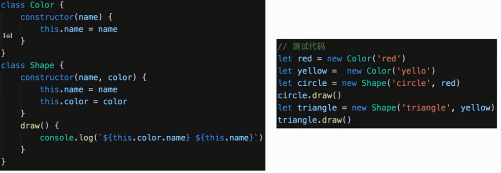

#### 设计模式验证
- 抽象和实现分离，解耦
- 符合开放封闭原则

### 组合模式
- 生成树形结构，表示 “整体-部分” 关系
- 让整体和部分都具有一致的操作方式

#### 演示
- JS 經典應用中未找到这么复杂的数据类型
- 虚拟 DOM 中的 vnode 是这种形式，但数据类型简单
- 整体和单个节点的操作方式是一致的
- 整体和单个节点的数据结构也保持一致
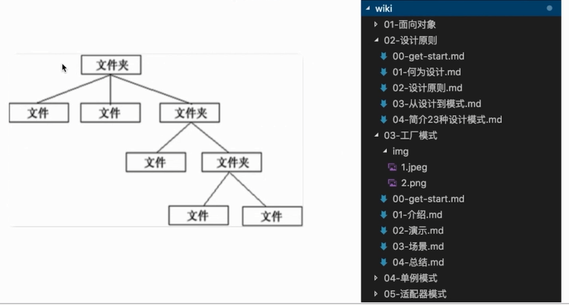

#### 设计原则验证
- 将整体和单个节点的操作抽象出来
- 符合开放封闭原则

### 享元模式
- 共享内存（主要考虑内存，而非效率）
- 相同的数据，共享使用

#### 演示
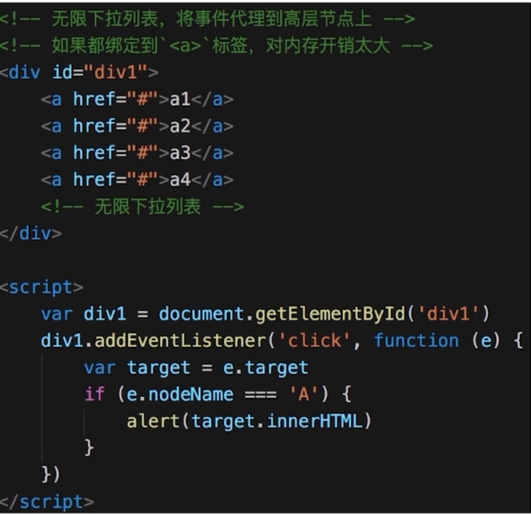

#### 设计原则验证
- 将相同的部分抽象出来
- 符合开放封闭原则

### 策略模式
- 不同策略分开处理
- 避免出现大量 if...else switch...case

#### 演示
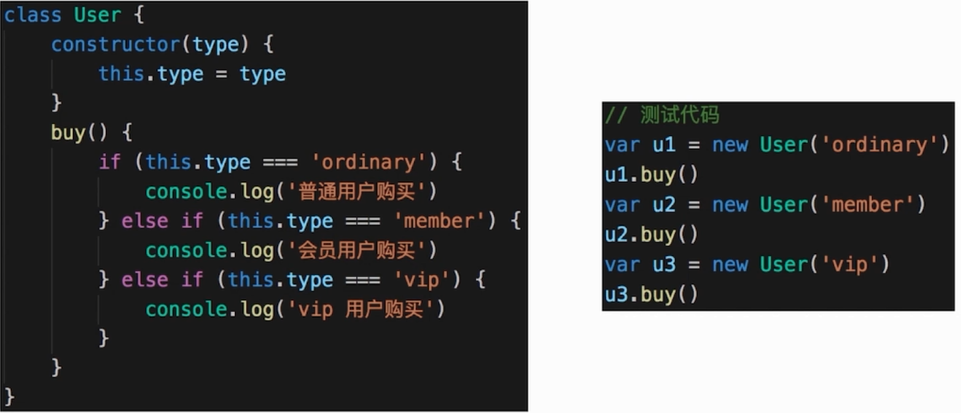
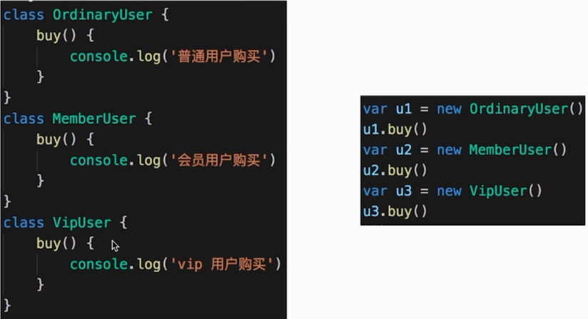

#### 设计原则验证
- 不同策略，分开处理，而不是混合在一起
- 符合开放封闭原则

### 模板方法模式
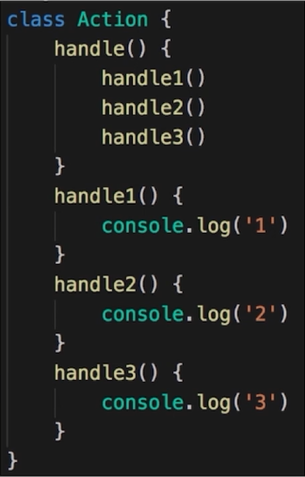

### 职责链模式
- 一步操作可能分位多个职责角色来完成
- 把这些角色都分开，然后用一个链串起来
- 将发起者和各个处理者隔离

#### 演示


#### JS 中的链式操作
- 职责链模式和业务结合较多，JS 中能联想到链式操作
- jQuery 的链式操作，Promise.then 的链式操作

#### 设计模式验证
- 发起者与各个处理者隔离
- 符合开放封闭原则

### 命令模式
- 执行命令时，发布者和执行者分开
- 中间加入命令对象，作为中转站

#### 演示
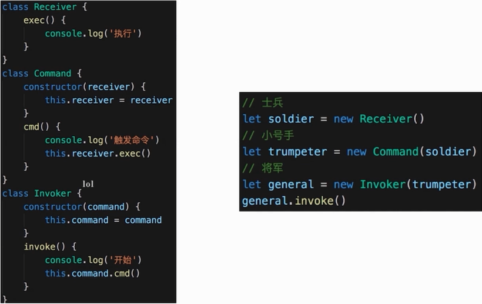

#### JS中的应用
- 王爷富文本编辑器操作，浏览器封装了一个命令对象
- document.execCommand('bold')
- document.execCommand('undo')

#### 设计原则验证
- 命令对象与执行对象分开，解耦
- 符合开放封闭原则

### 备忘录模式
- 随时记录一个对象的状态变化
- 随时可以恢复之前的某个状态（如撤销功能）

#### 演示
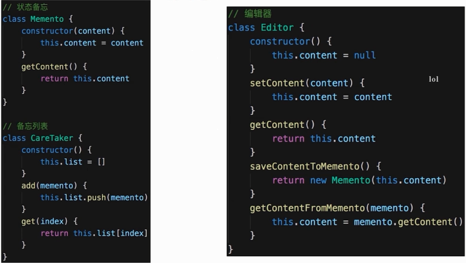
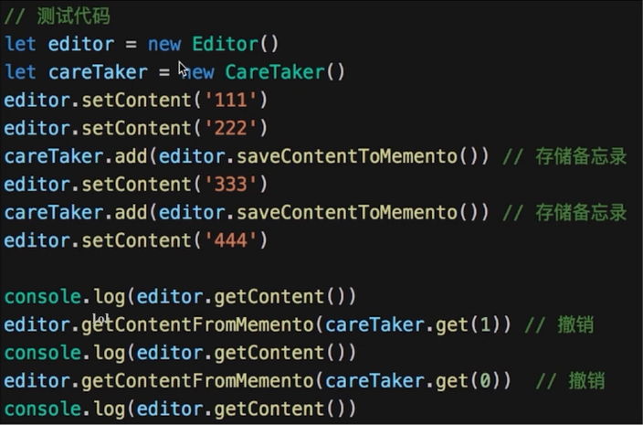

#### 设计模式验证
- 状态对象与使用者分开，解耦
- 符合开放封闭原则

### 中介者模式
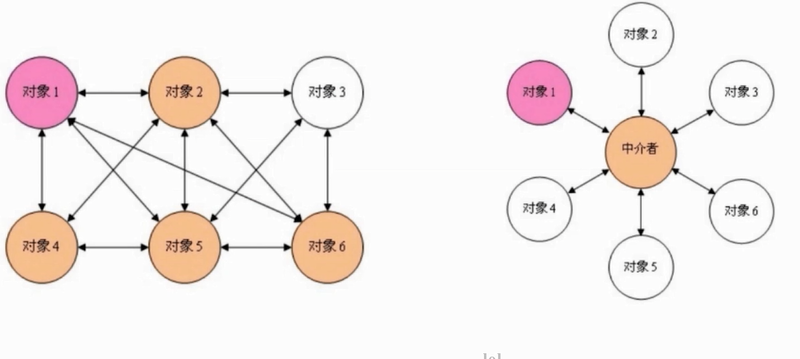
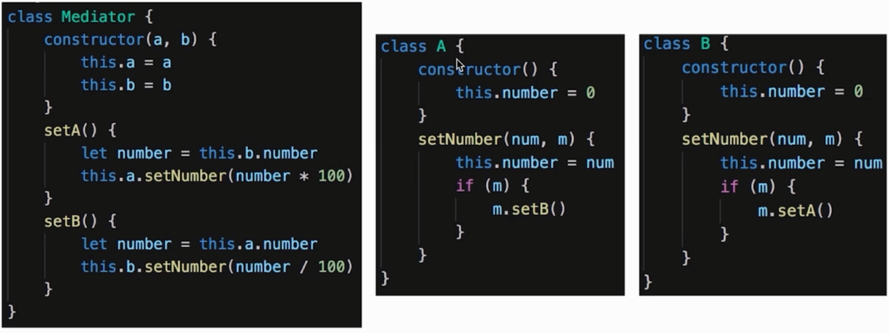

#### 设计原则验证
- 将各关联对象通过中介隔离
- 符合开放封闭原则

### 访问者模式
- 将数据操作和数据结构进行分离
- 使用场景不多

### 解释器模式
- 描述语言如何定义，如何解释和编译
- 用于专业场景

### 关于面试
- 能说出重点几个设计模式即可

### 日常使用
- 重点讲解的设计模式，要强制自己模仿、掌握
- 非常用的设计模式，视业务场景选择性使用
